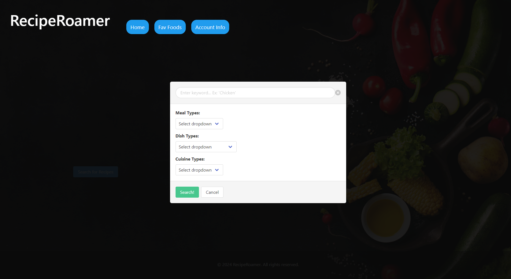

# Recipe Roamer

## Description

Welcome to Recipe Roamer! A solution to help users in their everyday lives when confronted with the question of "what should I make for dinner?", "what can I make with the ingredients I have in the fridge?", and "what are some new recipes I can make?"

As a team, we were motivated by the frustration of not knowing what new, exciting recipe to cook, and were excited by the possibility of making something that easily allows us (and other users) to simplify the recipe search process. We started looking at different APIs that would allow us to search for recipes given specific criteria, and we found Edamam's Recipe Search API; the core functionality of our website. Through their documentation and testing, we learned how best to utilize different search queries and paramaters when making/fetching the request to the API. To keep the page clean and interactive, we explored different methods of appending user input sections and the resulting API data into modal windows (appended onto different cards). We also utilized local storage to let users store their favorite recipes; preserving their data upon page refreshing/reloading. There's also a second API under the hood in this webiste: Google Maps. This allows users to open up a new modal on top of the recipe cards that will allow them to search for restaurants nearby their location that have the recipe they desire.

During this project, our team was fully remote; not being able to collaborate in person can be difficult. We learned the best practices for utilizing GitHub, creating local branches for working, merging and creating PRs to implement our work, and how to address merge conflicts.

We have future plans to continue developing this application - stay tuned for updates!

## Installation

N/A

## Usage

To use this applcation, please visit [this link](https://octozek.github.io/RecipeRoamer/).

Users will be greeted by the landing page of the application; a simple site with a nav bar, and a "Search" button on the middle left-hand side of the page.

Click on the button to start the search process for recipes. A modal will pop up with an input bar for keywords, and three dropdown menus.

Users will need to use **at least one** of the following search criteria:
In the input bar, users may enter key words or phrases to base the search off of (Ex. "Chicken," "Tacos," "Ramen," etc.)
The Meal Type dropdown lets users specify which category of meal the recipe will fall under (Ex. "Breakfast, Lunch/Dinner")
The Dish Type is an optional dropdown that lets users further specify what kind of food the recipes will be (Ex. "Pasta," "Salad," "Soup")
The Cuisine Type dropdown lets users specify which culture/country the dish originates from (Ex. "Italian," "American," "Asian")

Once at least one of these parameters has been filled out, users will then hit the "Search!" button in the modal. From there, the API will be sent a request with the various parameters/criteria as specified by the user. Once the request is complete, various cards will then be populated in a new modal with various recipes, along with images of each. Users can then select a button to view the recipe on how to make the dish, select a button to view restaurants with that dish in their area (via Google Maps), or save that recipe to their favorites (saved under local storage).

## Credits

This page was created by the following developers as part of the UNC Chapel Hill Programming Bootcamp:

Andrew Probel
Ian Haralalka
Armoni Prince
Ezekiel Owens
Jordan Davis

CSS Framework and documentation provided by Bulma:
https://bulma.io/documentation/

Thank you to the Edamam team for the creation of our Recipe Search API:
https://developer.edamam.com/edamam-recipe-api

Thank you to Google for providing the API for Google Maps:
https://console.cloud.google.com/google/maps-apis/build

Thank you to MDN Web Docs for documenting JavaScript usage:
https://developer.mozilla.org/en-US/docs/Web/API/Element/matches

## License

Please refer to the attached MIT license in the project repository.
